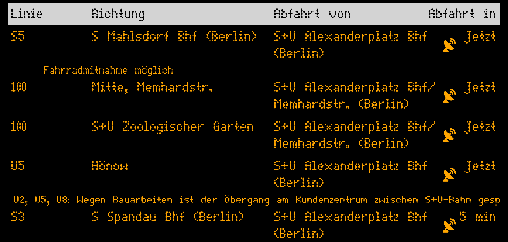

<p align="center">
  
</p>

# ha-weilSieDichLieben

A Home Assistant dashboard card that embeds the [weilSieDichLieben](https://github.com/genericJE/weilSieDichLieben) BVG departure board, distributed via [HACS](https://hacs.xyz/).



## Architecture

The card is a [LitElement](https://lit.dev/) custom element that mounts the upstream React components as a web component via [`@r2wc/react-to-web-component`](https://github.com/bitovi/react-to-web-component). The upstream React source lives in this repo as a git submodule at [`weilSieDichLieben/`](weilSieDichLieben/) and is consumed at build time by Rollup.

```
ha-weilSieDichLieben/
├── hacs.json                          # HACS manifest
├── info.md                            # shown in the HACS UI
├── src/
│   ├── card.ts                        # <weil-sie-dich-lieben-card> (LitElement shell)
│   ├── react-bridge.tsx               # mounts the React DepartureDisplay via r2wc
│   ├── editor.ts                      # visual config editor (Lit)
│   ├── map-tiles.ts                   # token for HA's map tile proxy (2026.10+)
│   └── types.ts                       # CardConfig + Station schema
├── dist/
│   └── weil-sie-dich-lieben-card.js   # built artifact, committed for HACS
└── weilSieDichLieben/                 # upstream React app (git submodule)
```

## Development

```bash
git clone --recurse-submodules https://github.com/genericJE/ha-weilSieDichLieben.git
cd ha-weilSieDichLieben
npm install
npm run build         # one-shot build → dist/
npm run typecheck     # tsc over src/, following imports into the submodule
npm run watch         # rebuild on change
```

If you forgot `--recurse-submodules` on clone:

```bash
git submodule update --init --recursive
```

## Installation

This card is in the [HACS](https://hacs.xyz/) default store — no custom repository needed:

1. Open HACS and search for **weilSieDichLieben Card**
2. Download it, then reload your browser when prompted
3. Add the card to a dashboard — the visual editor lets you search for BVG stations and toggle transport modes

Or jump straight to it:

[](https://my.home-assistant.io/redirect/hacs_repository/?owner=genericJE&repository=ha-weilSieDichLieben&category=plugin)

For kiosk-style fullscreen rendering, set the view to `panel: true`.

## Configuration

Use the visual editor (Card edit → Show visual editor) for stations and global settings, or edit YAML directly. Each station follows the upstream schema:

```yaml
type: custom:weil-sie-dich-lieben-card
stations:
  - id: "900100003"           # BVG station id
    value: "S+U Alexanderplatz"
    suburban: true            # S-Bahn
    subway: true              # U-Bahn
    tram: true
    bus: true
    ferry: false
    express: false
    regional: false
    when: 0                   # min minutes until departure
    results: 6                # number of departures to show
```

Global options, all optional:

| Option | Default | Effect |
|---|---|---|
| `fontSize` | `16` | Font size in px |
| `language` | `de` | `de` or `en` |
| `remarksVisibility` | `true` | Show remarks as scrolling rows under a departure |
| `standardRemarksVisibility` | `true` | Ask the BVG API for its standard remarks too |
| `hideDepartureCol` | `false` | Hide the "Abfahrt von" column |
| `hideRadar` | `false` | Hide the vehicle radar icons and popups |
| `layout` | `auto` | `auto` picks the table by card width; `wide` or `compact` pins one |

### Layout

By default the card switches to the upstream's compact table whenever it is
narrower than 576 px, whatever the screen size, so it also works in half a
section. Set `layout: wide` or `layout: compact` to pin one.

### Map tiles

On Home Assistant 2026.10 and newer the vehicle radar loads its map tiles
through the instance's own tile proxy (the `map_tiles` integration the
built-in map uses), so OpenStreetMap sees Home Assistant's User-Agent instead
of your installation's address. Older versions fetch the tiles from
`tile.openstreetmap.org` directly.

## License

MIT — see [LICENSE](LICENSE). Derived from [weilSieDichLieben](https://github.com/NikBLN/weilSieDichLieben) by Nikolas Tsombanis.

If anything here ends up being useful to you and you feel like saying thanks, my PayPal is https://paypal.me/genericJE. Truly no expectation either way, just leaving the option here in case.
