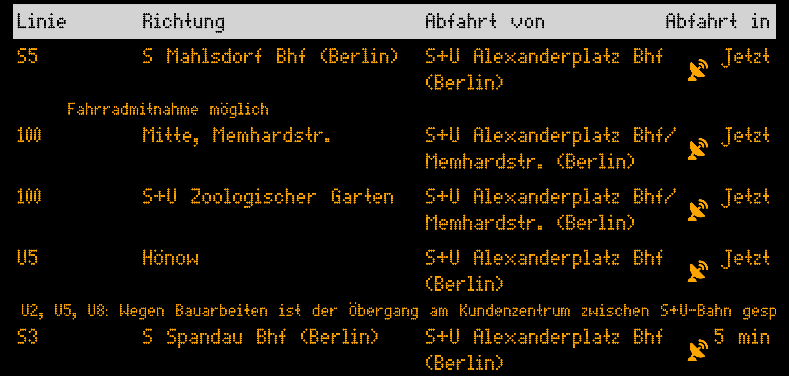

<p align="center">
  
</p>

# weilSieDichLieben Card

A Home Assistant Lovelace card that displays a BVG (Berlin public transport) departure board, powered by the [weilSieDichLieben](https://github.com/genericJE/weilSieDichLieben) project.



## Configuration

```yaml
type: custom:weil-sie-dich-lieben-card
stations:
  - id: "900100003"
    value: "S+U Alexanderplatz"
    suburban: true
    subway: true
    tram: true
    bus: true
    results: 6
    when: 0
```

See the [README](https://github.com/genericJE/ha-weilSieDichLieben) for the full station schema.
